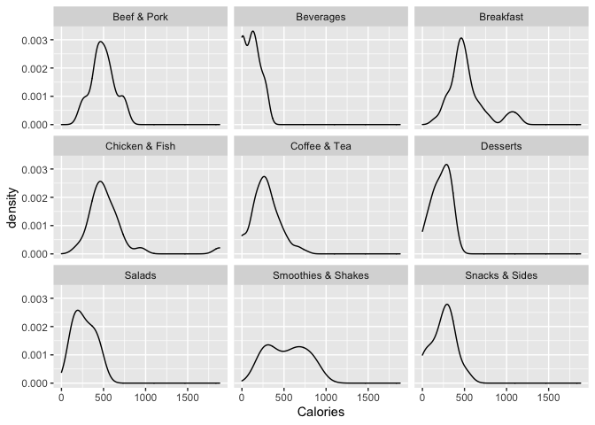

Exploratory Data Analysis using ggplot2
================
Aline D’Intino

``` r
library(tidyverse)
```

    ## ── Attaching packages ─────────────────────────────────────── tidyverse 1.3.1 ──

    ## ✓ ggplot2 3.3.5     ✓ purrr   0.3.4
    ## ✓ tibble  3.1.6     ✓ dplyr   1.0.7
    ## ✓ tidyr   1.1.4     ✓ stringr 1.4.0
    ## ✓ readr   2.1.1     ✓ forcats 0.5.1

    ## ── Conflicts ────────────────────────────────────────── tidyverse_conflicts() ──
    ## x dplyr::filter() masks stats::filter()
    ## x dplyr::lag()    masks stats::lag()

``` r
library(GGally)
```

    ## Registered S3 method overwritten by 'GGally':
    ##   method from   
    ##   +.gg   ggplot2

## Loading the data into R

``` r
menu <- read_csv('data/menu.csv')
```

    ## Rows: 260 Columns: 24

    ## ── Column specification ────────────────────────────────────────────────────────
    ## Delimiter: ","
    ## chr  (3): Category, Item, Serving Size
    ## dbl (21): Calories, Calories from Fat, Total Fat, Total Fat (% Daily Value),...

    ## 
    ## ℹ Use `spec()` to retrieve the full column specification for this data.
    ## ℹ Specify the column types or set `show_col_types = FALSE` to quiet this message.

## A first impression of the data

``` r
# Get an idea of what the menu dataset looks like
head(menu)
```

    ## # A tibble: 6 × 24
    ##   Category  Item           `Serving Size` Calories `Calories from F… `Total Fat`
    ##   <chr>     <chr>          <chr>             <dbl>             <dbl>       <dbl>
    ## 1 Breakfast Egg McMuffin   4.8 oz (136 g)      300               120          13
    ## 2 Breakfast Egg White Del… 4.8 oz (135 g)      250                70           8
    ## 3 Breakfast Sausage McMuf… 3.9 oz (111 g)      370               200          23
    ## 4 Breakfast Sausage McMuf… 5.7 oz (161 g)      450               250          28
    ## 5 Breakfast Sausage McMuf… 5.7 oz (161 g)      400               210          23
    ## 6 Breakfast Steak & Egg M… 6.5 oz (185 g)      430               210          23
    ## # … with 18 more variables: Total Fat (% Daily Value) <dbl>,
    ## #   Saturated Fat <dbl>, Saturated Fat (% Daily Value) <dbl>, Trans Fat <dbl>,
    ## #   Cholesterol <dbl>, Cholesterol (% Daily Value) <dbl>, Sodium <dbl>,
    ## #   Sodium (% Daily Value) <dbl>, Carbohydrates <dbl>,
    ## #   Carbohydrates (% Daily Value) <dbl>, Dietary Fiber <dbl>,
    ## #   Dietary Fiber (% Daily Value) <dbl>, Sugars <dbl>, Protein <dbl>,
    ## #   Vitamin A (% Daily Value) <dbl>, Vitamin C (% Daily Value) <dbl>, …

Transform the serving size variable into a numeric variable.

``` r
# Transformation drinks
drink.fl <- menu %>% 
  filter(str_detect(`Serving Size`, " fl oz.*")) %>% 
  mutate(`Serving Size` = str_remove(`Serving Size`, " fl oz.*")) %>% 
  mutate(`Serving Size` = as.numeric(`Serving Size`) * 29.5735)

drink.carton <- menu %>% 
  filter(str_detect(`Serving Size`, "carton")) %>% 
  mutate(`Serving Size` = str_extract(`Serving Size`, "[0-9]{2,3}")) %>% 
  mutate(`Serving Size` = as.numeric(`Serving Size`))

# Transformation food
food <-  menu %>% 
  filter(str_detect(`Serving Size`, "g")) %>% 
  mutate(`Serving Size` = (str_extract(`Serving Size`, "(?<=\\()[0-9]{2,4}"))) %>% 
  mutate(`Serving Size` = as.numeric(`Serving Size`))

# Add Type variable indicating whether an item is food or a drink 
menu2 <-  bind_rows(drink.fl, drink.carton, food) %>% 
  mutate(
   Type = case_when(
     as.character(Category) == 'Beverages' ~ 'Drinks',
     as.character(Category) == 'Coffee & Tea' ~ 'Drinks',
     as.character(Category) == 'Smoothies & Shakes' ~ 'Drinks',
     TRUE ~ 'Food'
   )
  )
```

``` r
head(menu2)
```

    ## # A tibble: 6 × 25
    ##   Category  Item           `Serving Size` Calories `Calories from F… `Total Fat`
    ##   <chr>     <chr>                   <dbl>    <dbl>             <dbl>       <dbl>
    ## 1 Beverages Coca-Cola Cla…           473.      140                 0           0
    ## 2 Beverages Coca-Cola Cla…           621.      200                 0           0
    ## 3 Beverages Coca-Cola Cla…           887.      280                 0           0
    ## 4 Beverages Coca-Cola Cla…           355.      100                 0           0
    ## 5 Beverages Diet Coke (Sm…           473.        0                 0           0
    ## 6 Beverages Diet Coke (Me…           621.        0                 0           0
    ## # … with 19 more variables: Total Fat (% Daily Value) <dbl>,
    ## #   Saturated Fat <dbl>, Saturated Fat (% Daily Value) <dbl>, Trans Fat <dbl>,
    ## #   Cholesterol <dbl>, Cholesterol (% Daily Value) <dbl>, Sodium <dbl>,
    ## #   Sodium (% Daily Value) <dbl>, Carbohydrates <dbl>,
    ## #   Carbohydrates (% Daily Value) <dbl>, Dietary Fiber <dbl>,
    ## #   Dietary Fiber (% Daily Value) <dbl>, Sugars <dbl>, Protein <dbl>,
    ## #   Vitamin A (% Daily Value) <dbl>, Vitamin C (% Daily Value) <dbl>, …

## Variation

Get an idea of the variation among item categories and nutritional
value.

``` r
ggplot(data = menu2) +
  geom_bar(mapping = aes(x = Category)) +
  coord_flip()
```

<!-- -->

Plot the distribution of ‘Calories’ using ’geom_histogram.

``` r
ggplot(data = menu2) +
  geom_histogram(mapping = aes(x = Calories), binwidth = 30) 
```

<!-- -->

``` r
# The distribution is slightly skewed to the right, most items contain less than 750 calories.
# There is one outlier containing almost 2000 calories.
```

## Association

Plot the association between different variables.

``` r
ggplot(data = menu2) +
  geom_density(mapping = aes(x = Calories)) +
  facet_wrap(~Category)
```

<!-- -->

``` r
# The Chicken & Fish density plot shows a little bump at the end, the outlier of almost 2000 calories is a Chicken & Fish item.
```

Spot outliers by creating a boxplot.

``` r
ggplot(data = menu2) +
  geom_boxplot(mapping = aes (x = Category, y = Calories)) +
  coord_flip()
```

<!-- -->

``` r
# It's very easy to see now that the outlier is in the Chicken & Fish category.
```

Check which item it is that has such a high energetic value.

``` r
menu2 %>% 
  filter(Category == "Chicken & Fish") %>% 
  ggplot(mapping = aes(x = Item, y = Calories)) +
  geom_col() +
  coord_flip()
```

<!-- -->

``` r
# The item containing the stunning amount of almost 2000 calories is the 40 piece Chicken McNuggets.
```

Check whether there is an association between the serving size and the
number of calories.

``` r
ggplot(data = menu2, mapping = aes(x = `Serving Size`, y = Calories)) +
  geom_point(alpha = 0.5) 
```

<!-- -->

``` r
# There doesn't seem to be a strong relationship between the portion size and energetic value based on this plot. However, this seems highly counter intuitive since you'd expect that the larger the portion, the more calories it contains.
```

``` r
ggplot(data = menu2, mapping = aes(x = `Serving Size`, y = Calories, colour = Type)) +
  geom_point() +
  geom_smooth(method = 'lm')
```

    ## `geom_smooth()` using formula 'y ~ x'

<!-- -->

``` r
# When splitting up the data in drinks and food, we see that there is actually a very strong relation between serving size and calories for the food items, where the association is very weak for the drink items.
```

A part of the drink-type items are items with no calories at all (coffee/tea, light sodas), so for these items the correlation between calories and serving size is zero. This items are likely to deflate the correlation for drink-type items a lot. A way of investigating this hypothesis using a visualisation is this:

``` r
menu2 %>% 
  filter(Type == 'Drinks') %>% 
    ggplot(mapping = aes(x = `Serving Size`, y = Calories, colour = Category)) +
    geom_point() +
    geom_smooth(method = 'lm')
```

    ## `geom_smooth()` using formula 'y ~ x'

<!-- -->

``` r
# As can be seen from the plot, the association between categories containing 0 calory items (Beverages and Coffee& Tea) is far weaker than the category wihout 0 calory items (Smoothies & Shakes)
```

Create a plot using ggpairs() where the association between at least 4
different variables is visualized.

``` r
ggpairs(menu2, columns = c('Serving Size', 'Calories', 'Total Fat', 'Carbohydrates', 'Protein'), ggplot2::aes(colour = Type))
```

<!-- -->

``` r
# Using this plot, we can see that the correlations change a lot when you take into account the item type. This phenomenon, where the correlation disappears or even changes of direction when taking groups into account, is called the Simpson's paradox. 
```
